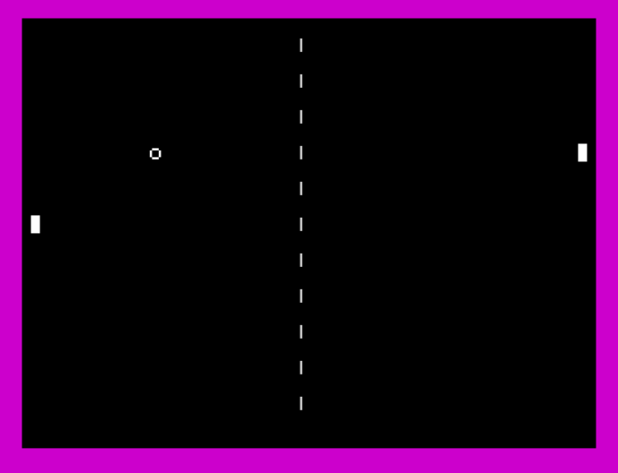

# pong_zx
ZX Spectrum assembly showing the framework for a basic pong game.

there is no collision detection, but that should be fairly easy for anyone else to include e.g 
IF ballX = playerX and ballY = playerY = we have a collision, so the ball reverses (neg ix+5 and ix+6) 

you do the same with the enemy paddle. 

I have the ball bouncing around the screen but obviously if it goes off the edge of Y then its a
point to the other player. 

Anyway its all very rough and ready and cobbled together quickly just to show an example. Don't 
bug me about it! 

This is designed to work in the excellent Z80 assembler program ZEUS by Design Design / Simon
Brattel. A true legend! 

